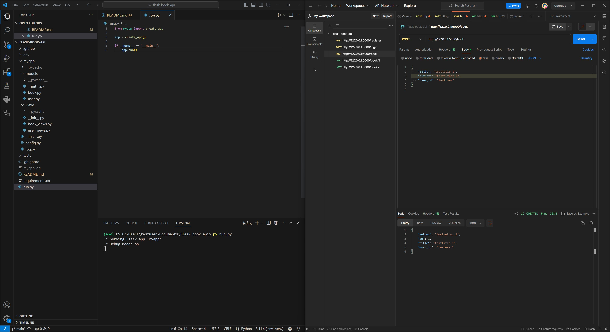
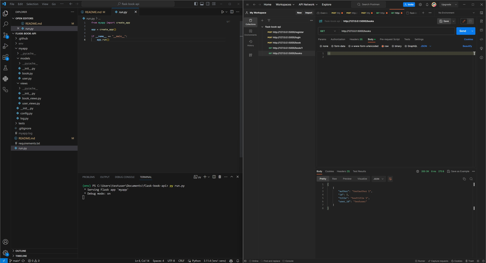

# flask-book-api

Commands to start app on Windows:

1. py -m venv env
2. Set-ExecutionPolicy -ExecutionPolicy Unrestricted -Scope Process
3. .\env\Scripts\activate
4. pip install windows-curses
5. py main.py